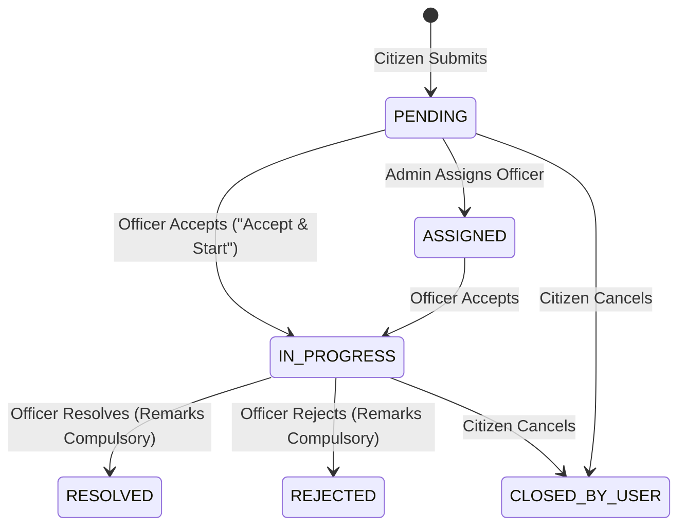

# Smart Grievance Redressal System - Backend Documentation

This document provides a comprehensive overview of the backend architecture, technology stack, API endpoints, officer portal redressal flow, and security configurations. This is a college campus grievance redressal backend (college campus grievance redressal system).

---

## 1. Technology Stack

*   **Language**: Java 17 (LTS)
*   **Core Framework**: [Spring Boot 3.1.5](https://spring.io/projects/spring-boot)
*   **Security**: [Spring Security 6](https://spring.io/projects/spring-security) with stateless JWT authentication via **JJWT (io.jsonwebtoken 0.12.3)**.
*   **Database**: [MySQL 8.0](https://www.mysql.com/) with HikariCP connection pooling and Spring Data JPA (Hibernate 6.2).
*   **API Documentation**: [Springdoc OpenAPI 2.1.x](https://springdoc.org/) (`/swagger-ui.html`; OpenAPI spec at `/api-docs`).
*   **DTO Mapping**: [ModelMapper](https://modelmapper.org/) with explicit response decorators.
*   **Boilerplate Control**: [Lombok](https://projectlombok.org/).
*   **Email Notification**: Spring Boot Mail (`JavaMailSender`) with automatic development mocking.

---

## 2. Architecture & Design Patterns

The backend follows an **N-Tier Layered Architecture** with strict boundary separation:

1.  **Controller Layer (`com.grievance.controller`)**: Exposes RESTful endpoints, handles HTTP parameter binding, validates inputs via Jakarta Validation (`@Valid`), and protects methods via `@PreAuthorize`.
2.  **Service Layer (`com.grievance.service`)**: Encapsulates transactional business logic (`@Transactional`), department access control, SLA calculations, and audit history creation.
3.  **Repository Layer (`com.grievance.repository`)**: Interacts with MySQL through Spring Data JPA and custom JPQL queries.
4.  **Security Layer (`com.grievance.security`)**: Intercepts requests using `JwtAuthenticationFilter` and loads user permissions into Spring's `SecurityContext`.

---

## 3. Officer Redressal & Department Security

### Department Scoping Logic
* An officer belongs to a specific Department (`department_id` in the `User` entity), set through admin assignment or seeded once per department during dev startup.
* Officers are strictly scoped to their assigned department: the backend enforces this at every query and mutation (claim, update status, etc.).
* The enforcement checks vehicles include `officer.getDepartment().getId().equals(grievance.getDepartment().getId())` for ownership/claim actions, plus scope filtering on the assigned-grievances query (`DEPT_POOL`, `MY_TASKS`, `RESOLVED`) that always scopes to the officer's department.
* **Privacy masking for non-admin/non-officer callers**: `getGrievanceDetails` masks sensitive fields for regular authenticated students; `getRecentGrievances` and the global feed return a privacy-safe projection. Full details require ownership, officer, or admin context.

### Grievance Lifecycle Transitions

---

## 4. API Endpoints Reference

### 4.1 Authentication (`/api/auth`)
| Endpoint | Method | Role | Description | Request Body |
| :--- | :--- | :--- | :--- | :--- |
| `/api/auth/register` | `POST` | Public | Register a new citizen account | `RegisterRequest` |
| `/api/auth/login` | `POST` | Public | Authenticate and obtain JWT token | `LoginRequest` |
| `/api/auth/logout` | `POST` | Authenticated | Invalidate session | N/A |

### 4.2 Grievance Management (`/api/grievances`)
| Endpoint | Method | Role | Description | Parameters / Body |
| :--- | :--- | :--- | :--- | :--- |
| `/api/grievances` | `POST` | USER | Submit new grievance with multipart attachment | `title`, `description`, `departmentId`, `priority`, `file` |
| `/api/grievances/my` | `GET` | USER | List current citizen's grievances | N/A |
| `/api/grievances/assigned` | `GET` | OFFICER, ADMIN | Fetch grievances filtered by scope (`DEPT_POOL`, `MY_TASKS`, `RESOLVED`) | `?scope=DEPT_POOL` |
| `/api/grievances/{id}/accept` | `PUT` | OFFICER, ADMIN | Claim a department-pool (unassigned/assigned) grievance and transition to `IN_PROGRESS` (`Accept & Start`). Requires the ticket to be eligible for the officer's department. | Path Variable `id` |
| `/api/grievances/{id}/status` | `PUT` | OFFICER, ADMIN | Resolve or reject grievance with **mandatory resolution remarks**. Invalid status transitions are rejected server-side (`ALLOWED_TRANSITIONS` → 400 Bad Request). | `UpdateStatusRequest` (`status`, `resolutionRemarks`) |
| `/api/grievances/{id}` | `GET` | Authenticated | View full grievance details with role-based privacy masking (full details for owner/officer/admin; masked projection for other authenticated users). | Path Variable `id` |
| `/api/grievances/{id}/history` | `GET` | Authenticated | Retrieve audit history timeline (`grievance_history` rows: who, from-status, to-status, remarks, timestamp). | Path Variable `id` |
| `/api/grievances/{id}/upvote` | `POST` | Authenticated | Toggle upvote on a grievance (toggles `hasUpvoted` + `upvoteCount` on the response). | Path Variable `id` |
| `/api/grievances/{id}/close` | `PUT` | USER | Close / cancel own grievance (`CLOSED_BY_USER`). Requires the caller to own the grievance. | Path Variable `id`; optional `remarks` in body |
| `/api/grievances/{id}` | `DELETE` | ADMIN | Delete grievance from system. | Path Variable `id` |

### 4.3 Dashboards & Analytics (`/api/dashboard`)
| Endpoint | Method | Role | Response Payload |
| :--- | :--- | :--- | :--- |
| `/api/dashboard/officer` | `GET` | OFFICER, ADMIN | `{ deptUnassignedCount, myActiveTasksCount, myResolvedCount, slaBreachedCount, departmentName }` |
| `/api/dashboard/user` | `GET` | USER | `{ myGrievances, pendingGrievances, resolvedGrievances, myAverageRating }` |
| `/api/dashboard/admin` | `GET` | ADMIN | System totals, department breakdown map, daily & weekly trend counts |

### 4.4 Feedback (`/api/feedback`)
| Endpoint | Method | Role | Description |
| :--- | :--- | :--- | :--- |
| `/api/feedback` | `POST` | USER | Submit 1–5 star rating and comment on a resolved ticket |
| `/api/feedback/grievance/{id}` | `GET` | Authenticated | Get all feedback entries for a grievance |

---

## 5. Seeded Accounts & Data Initialization

On application startup, `com.grievance.config.DataInitializer` ensures the following demo records exist:

* **Administrator**:
  * Username: `admin12`
  * Password: `admin1234` (overridable via `demo.admin.password` property/env var)
  * Role: `ROLE_ADMIN`
* **Seeded departments** (created only when the `dev` Spring profile is active):
  * **Hostel & Accommodation** — hostel room issues, maintenance, accommodation complaints
  * **Academics & Examinations** — academic issues, grade discrepancies, exam-related complaints
  * **IT & Infrastructure** — WiFi, lab computers, classroom AV, campus infrastructure
  * **Canteen & Mess** — food quality, hygiene, canteen/mess service complaints
  * **Administration** — ID cards, certificates, fee receipts, general administrative complaints
* **Grievance Officers** (one per department; password overridable via `demo.officer.password`):
  * `officer1` — `officer1234` → Hostel & Accommodation (Hostel Warden)
  * `officer2` — `officer1234` → Academics & Examinations (Exam Cell)
  * `officer3` — `officer1234` → IT & Infrastructure (IT Support)
  * `officer4` — `officer1234` → Canteen & Mess (Mess Supervisor)
  * `officer5` — `officer1234` → Administration (Admin Office)
* **Student accounts** — self-register normally; no default student account is seeded.

> **Dev profile required for seeding.** On startup, `DataInitializer` creates these demo records only when the `dev` Spring profile is active. Existing accounts are *not* password-reset on restart; the initializer reassigns officers to their correct departments each startup so stale mappings are corrected.

---

## 6. Email Service Behavior

The `EmailService` is configured to run asynchronously (`@Async`):
* **Development Mode (Default)**: Automatically detects placeholder credentials (`your-email@gmail.com`) and routes messages to standard info logs (`📧 [Dev Email Mock] ...`), ensuring zero exceptions or connection timeouts.
* **Live Mode**: Set `spring.mail.username` and `spring.mail.password` in `application.properties` with a valid Gmail App Password to trigger live email deliveries.
