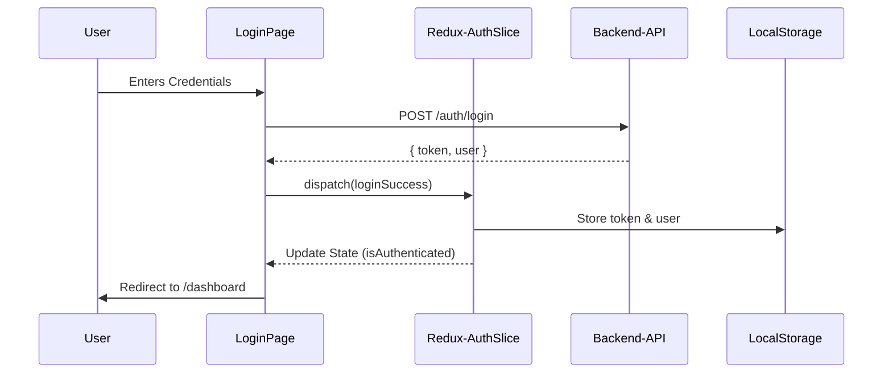
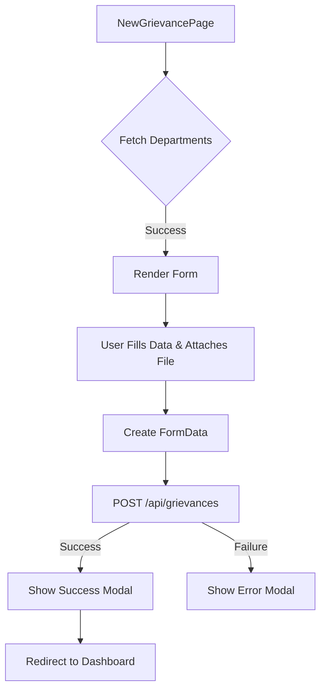
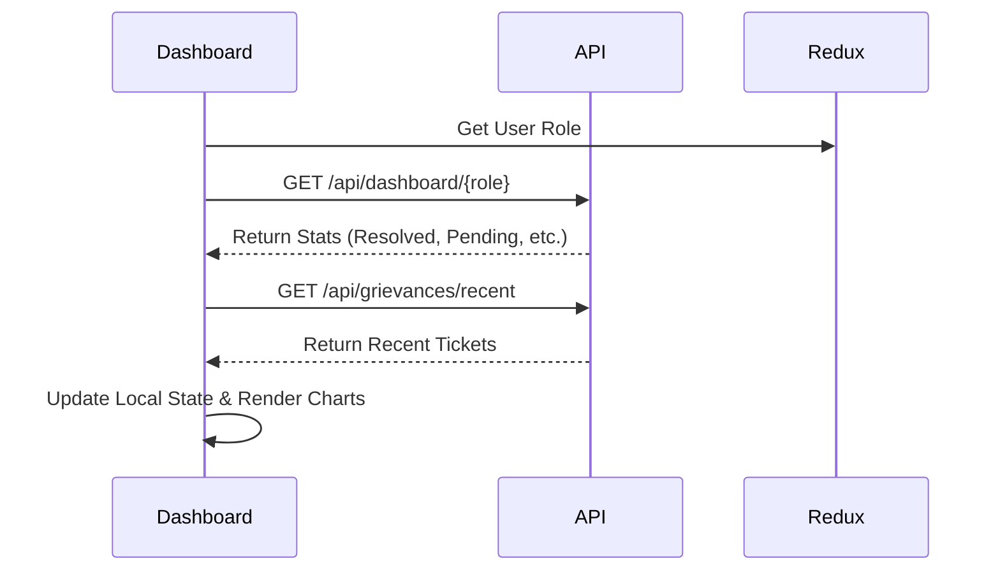

# Smart Grievance System - Frontend Documentation

This document provides a comprehensive overview of the Smart Grievance System's frontend architecture, technology stack, and application flows.

---

## 🚀 Technology Stack

The application is built using modern web technologies to provide a premium, responsive, and high-performance user experience.

- **Framework**: [React](https://reactjs.org/) (Version 18+)
- **Build Tool**: [Vite](https://vitejs.dev/)
- **Styling**: 
  - [Tailwind CSS](https://tailwindcss.com/) for utility-first styling.
  - [Shadcn UI](https://ui.shadcn.com/) for high-quality, accessible UI components.
  - [Lucide React](https://lucide.dev/) for iconography.
- **State Management**: [Redux Toolkit](https://redux-toolkit.js.org/)
- **Routing**: [React Router DOM](https://reactrouter.com/) (Version 6+)
- **API Communication**: [Axios](https://axios-http.com/)
- **Data Visualization**: [Recharts](https://recharts.org/)

---

## 📁 Folder Structure

```
Frontend/
├── public/              # Static assets (logos, icons)
├── src/
│   ├── assets/          # Global styles and images
│   ├── components/      # Reusable UI components
│   │   ├── layout/      # Navbar, Footer, MainLayout
│   │   └── ui/          # Shadcn UI base components
│   ├── lib/             # Utilities and API configuration
│   ├── pages/           # Route-specific page components
│   ├── store/           # Redux store and slices
│   ├── App.jsx          # Main routing and layout wrapper
│   ├── main.jsx         # Application entry point
│   └── index.css        # Global CSS and Tailwind directives
├── package.json         # Project dependencies and scripts
└── tailwind.config.js   # Tailwind CSS configuration
```

---

## 🔐 Authentication Flow

The system uses JWT-based authentication. The state is managed via Redux, and persistent sessions are handled using `localStorage`.



### Protected Routes
Routes are wrapped in a `ProtectedRoute` component that checks the `isAuthenticated` state from Redux. If the user is not logged in, they are redirected to `/login`.

---

## 📝 Grievance Submission Flow

Users can submit grievances through a multi-part form that supports file uploads (evidence).



### Multiparts Handling
The submission uses `FormData` to handle both JSON data (title, description, etc.) and the evidence file.
- **Header**: `Content-Type: multipart/form-data`

---

## 📊 Dashboard Data Flow

The dashboard dynamically fetches data based on the user's role (Citizen or Admin) to show relevant statistics and recent activities.



---

## 🔌 API Endpoint Mappings

All API calls are routed through a central Axios instance in `lib/api.js`.

| Method | Endpoint | Description | Usage |
| :--- | :--- | :--- | :--- |
| `POST` | `/auth/login` | User authentication | `LoginPage` |
| `GET` | `/grievances/all` | Fetch all grievances (Admin) | `RecentGrievancesPage` |
| `GET` | `/grievances/my` | Fetch citizen's grievances | `MyGrievancesPage` |
| `GET` | `/grievances/recent` | Fetch most recent grievances | `DashboardPage` |
| `GET` | `/grievances/departments` | Fetch available departments | `NewGrievancePage` |
| `POST` | `/grievances` | Submit a new grievance | `NewGrievancePage` |
| `GET` | `/grievances/{id}` | Fetch grievance details | `GrievanceDetailsPage` |
| `GET` | `/grievances/{id}/history` | Fetch grievance status history | `GrievanceDetailsPage` |
| `PUT` | `/grievances/{id}/close` | Close/Archive a grievance | `GrievanceDetailsPage` |
| `GET` | `/dashboard/{role}` | Fetch role-specific statistics | `DashboardPage` |
| `GET` | `/user/profile` | Fetch user profile data | `ProfilePage` |
| `PUT` | `/user/profile` | Update user profile data | `ProfilePage` |
| `PUT` | `/user/change-password` | Update account password | `ProfilePage` |

---

## 🔧 Technical Details

### 1. API Interceptors
The application uses Axios interceptors to:
- **Request**: Automatically inject the JWT token from the Redux store into the `Authorization` header.
- **Response**: Handle `401 Unauthorized` errors by automatically logging out the user and clearing the session.

### 2. State Persistence
The `authSlice` synchronizes the logic state with `localStorage`, ensuring the user remains logged in after a page refresh.

### 3. Responsive Layout
The `MainLayout` uses a flexible flexbox structure with a sticky footer and a responsive navbar, ensuring a seamless experience across mobile, tablet, and desktop devices.
