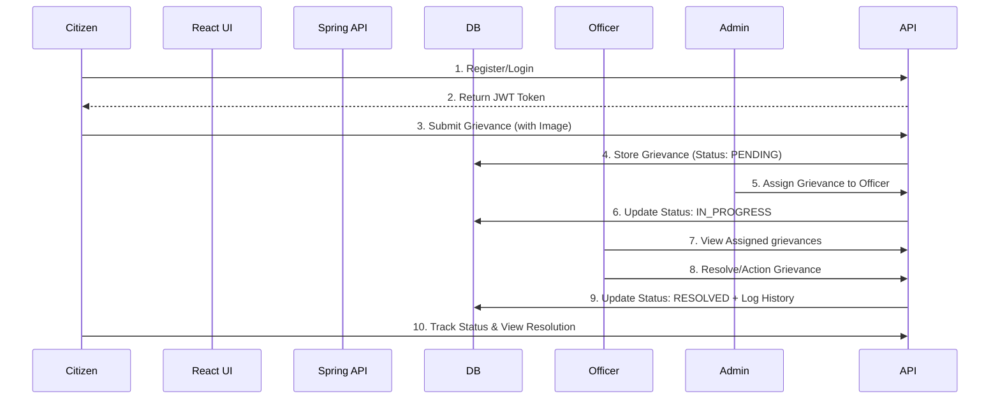

# Smart Grievance System - Complete Project Help & Guide

Welcome to the **Smart Grievance System (SGS)**. This document serves as the comprehensive, centralized guide to understanding the complete project flow, architecture, API endpoints, and setup instructions.

## 1. Executive Summary
The Smart Grievance System is a professional, production-ready grievance redressal platform designed for efficient communication between citizens, department officers, and administrators. It ensures transparency, security, and scalability.

- **Stack**: Spring Boot 3 (Java 17), React 18+ (Vite), MySQL 8.0, Tailwind CSS + Shadcn UI.
- **Security**: Stateless JWT Authentication, Role-Based Access Control (USER, OFFICER, ADMIN).

## 2. Complete Project Flow
The system follows a Decoupled Architecture separating the React frontend from the Spring Boot backend API.

### Grievance Lifecycle & Logic Flow
1. **Registration & Auth**: Citizen logs in or registers via the frontend. The backend issues a JWT token.
2. **Submission**: Citizen submits a grievance (title, description, department, priority, and optional image attachment).
3. **Database Storage**: The backend stores the grievance with an initial status of `PENDING`.
4. **Assignment**: An `ADMIN` assigns the grievance to a specific department officer.
5. **Processing**: The assigned `OFFICER` logs in, views the grievance, updates its status to `IN_PROGRESS`, and eventually `RESOLVED`.
6. **Notification/Tracking**: The citizen tracks the real-time status dynamically on their dashboard and can view remarks left by the officer.
7. **Resolution**: Once resolved, the citizen can provide post-resolution feedback.



## 3. Backend Architecture & Complete API Endpoints
The backend uses an N-Tier architecture (Controller -> Service -> Repository) connected to MySQL.

### Data Flow for Submission
- **Client** POSTs to `/api/grievances` (multipart/form-data).
- **SecurityFilter** validates JWT.
- **Controller** delegates to **Service**.
- **Service** saves file locally via `FileStorageService`, links to User and Department, creates `Grievance` entity, saves to repository, and logs history.

### Complete API Reference

#### 🔐 Authentication (`/api/auth`)
| Endpoint | Method | Description |
| :--- | :--- | :--- |
| `/register` | `POST` | Register a new user |
| `/login` | `POST` | Authenticate and get JWT token |
| `/logout` | `POST` | Invalidate session (client-side) |

#### 👤 User Management (`/api/user` & `/api/admin`)
| Endpoint | Method | Description |
| :--- | :--- | :--- |
| `/profile` | `GET/PUT` | Get/Update current user profile |
| `/change-password` | `PUT` | Change current user password |
| `/` | `GET` | (Admin) List all users |
| `/{id}/role` | `PUT` | (Admin) Change user role |
| `/departments` | `GET/POST` | (Admin) Manage Departments |

#### 📝 Grievances (`/api/grievances`)
| Endpoint | Method | Description |
| :--- | :--- | :--- |
| `/` | `POST` | Submit a new grievance (Multipart) |
| `/my` | `GET` | List grievances for current citizen |
| `/all` | `GET` | Global feed of all grievances (anonymized) |
| `/recent` | `GET` | Get top 5 recent pending grievances |
| `/assigned` | `GET` | List grievances assigned to the officer |
| `/{id}` | `GET` | Get complete details of a grievance |
| `/{id}/history` | `GET` | View timeline history of a grievance |
| `/{id}/status`| `PUT` | Update status (Officer/Admin) |
| `/{id}/accept`| `PUT` | (Officer) Accept a pending assigned grievance |

#### 📊 Dashboards (`/api/dashboard`)
| Endpoint | Method | Description |
| :--- | :--- | :--- |
| `/user` | `GET` | Stats for citizen (Pending, Resolved, Total) |
| `/officer` | `GET` | Stats for officer (Assigned, In Progress) |
| `/admin` | `GET` | System-wide analytics and trends |

#### 💬 Feedback (`/api/feedback`)
| Endpoint | Method | Description |
| :--- | :--- | :--- |
| `/` | `POST` | Submit feedback/rating for resolved grievance |
| `/my` | `GET` | List user's feedback |
| `/grievance/{id}`| `GET` | Get feedback for a specific grievance |

## 4. Frontend Architecture & Flow
Built with React 18, Vite, Tailwind CSS, and Shadcn UI. Features a premium "Dimensional Interface" aesthetic (Aether Purple and Prism Cyan).

### Key Flows
- **Authentication**: JWT stored in `localStorage`, synced with Redux. Axios interceptors automatically attach the token and handle `401 Unauthorized` logouts.
- **Submission Flow**: Uses `FormData` to send multipart JSON and File attachments.
- **Dashboards**: Dynamically fetches data based on user role (`Citizen` vs `Admin`), rendering Recharts analytics and recent activity feeds.
- **Routing**: `react-router-dom` using `ProtectedRoute` wrappers.

## 5. Setup & Running the Application

### Prerequisites
- Java 17+, Maven 3.6+
- Node.js 18+
- MySQL 8.0

### Database Setup
```sql
CREATE DATABASE smart_grievance_db;
```

### Backend Setup
1. Update `src/main/resources/application.properties` with your MySQL credentials.
2. Build and run:
```bash
mvn clean install
mvn spring-boot:run
```

### Frontend Setup
1. Open a new terminal in the `Frontend/` folder.
2. Install dependencies:
```bash
npm install
```
3. Run the development server:
```bash
npm run dev
```
4. Access at `http://localhost:5173`.

## 6. Key Mechanisms & Privacy
- **Stateless Auth**: Complete JWT-based protection using Spring Security `@PreAuthorize` constraints.
- **Privacy Assurance**: Any global listing dynamically masks Citizen names (e.g., `A*** S***`) for all users except Admins, protecting privacy while maintaining transparency.
- **Audit Trails**: Every status change on a grievance is recorded into a strictly chronologically ordered History Table.
