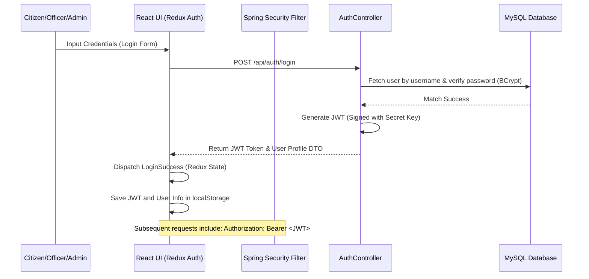
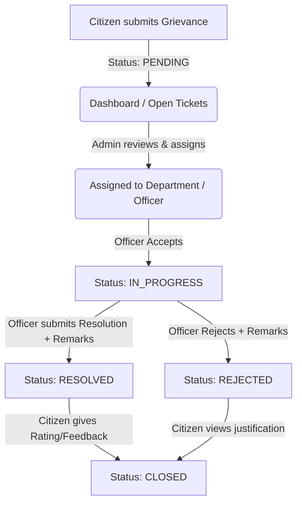
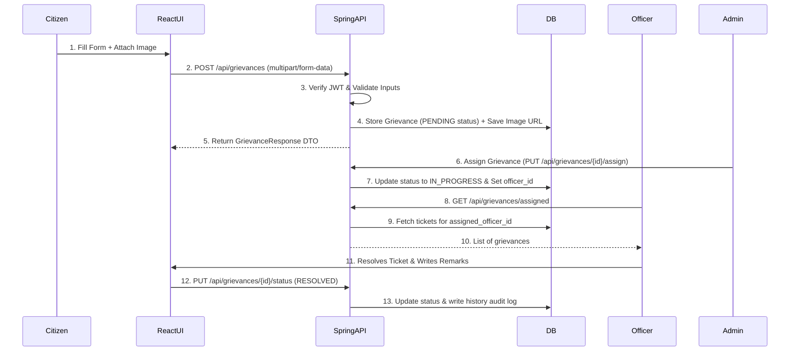

# 🌟 Smart Grievance Redressal System (SGS) — Project Handover & Developer Guide

Welcome to the **Smart Grievance Redressal System (SGS)** documentation. This comprehensive document is designed to act as your complete developer reference and onboarding guide. It aggregates all system architectures, workflows, endpoints, components, and schema details, ensuring a smooth transition for future development.

---

## 📅 Project Metadata & Status
* **Status**: Fully Integrated & Production-Ready Full-Stack Web Application
* **Backend Stack**: Spring Boot 3.1.5 (Java 17), Spring Security, JPA/Hibernate, MySQL 8.0, JWT Authentication
* **Frontend Stack**: React 18, Vite, Tailwind CSS, Redux Toolkit, React Router DOM, Shadcn UI
* **Deployment Pattern**: Decoupled Client-Server Architecture

---

## 🏗️ 1. Architecture Overview & Tech Stack

The system follows a **Decoupled N-Tier Architecture** that isolates the user interface from the API and data access logic, enabling independent scaling and clean division of responsibilities.

```
       +---------------------------------------------+
       |             React + Vite UI                 |
       |  (State: Redux Toolkit | styling: Tailwind) |
       +----------------------+----------------------+
                              |
                     HTTPS    |  Axios Requests
                     REST     |  (JWT Token injected in Headers)
                              v
       +----------------------+----------------------+
       |            Spring Boot 3 API                |
       |                                             |
       |  [Controller] Layer                         |
       |       |                                     |
       |  [Security] Layer (JWT Filter, RBAC)        |
       |       |                                     |
       |  [Service] Layer (Business Logic)           |
       |       |                                     |
       |  [Repository] Layer (Spring Data JPA)       |
       +----------------------+----------------------+
                              |
                    JDBC      |  SQL Queries
                              v
       +----------------------+----------------------+
       |           MySQL 8.0 Database                |
       |  (Normalized Schema, Indices, Auto-Seeds)   |
       +---------------------------------------------+
```

### Key Technical Choices & Rationale
1. **JWT Stateless Authentication**: By using JSON Web Tokens, the backend doesn't store active user sessions. The token is generated on login, stored securely on the client, and validated on every API call. This makes the system scalable and easy to cluster.
2. **Axios Interceptors**: The React frontend uses automatic HTTP interceptors to append the token to all outgoing requests and automatically catch `401 Unauthorized` responses to trigger client-side logouts.
3. **Repository Pattern with Spring Data JPA**: Decouples the service logic from JDBC queries, making database operations abstract and enabling easy unit testing.
4. **Shadcn UI & Stitch Design System**: Custom layouts styled with Tailwind CSS, utilizing glassmorphism and a consistent aether-purple theme, providing a premium visual appeal.

---

## 🔄 2. Core Workflows & Logic Flow

Below are visual flows illustrating the primary business logic loops of the application.

### A. Authentication & Security Flow
Whenever a user logs in, they are issued a JWT. All subsequent secure requests require this token.



### B. Grievance Lifecycle & Status Transition
The status of a grievance progress through a sequence of stages managed by different roles:



### C. Sequence Diagram: Submitting and Resolving a Ticket



---

## 📈 3. Database Architecture & Schema

The database is normalized to the 3rd Normal Form (3NF) to minimize redundancy and guarantee data consistency.

### Table Layout & Constraints
The database (`smart_grievance_db`) consists of five primary tables:

1. **`users`**: Details user profiles, passwords, and security tiers (`USER`, `OFFICER`, `ADMIN`). Officers have a foreign key linking them to a department.
2. **`departments`**: Government or system sectors (e.g., Public Works, Electricity) responsible for handling tickets.
3. **`grievances`**: Tracks the ticket information, status, severity, assigned handler, and submitter.
4. **`grievance_history`**: Audit trail storing the history log of status updates, remarks, and who made the change.
5. **`feedback`**: Post-resolution ratings and reviews submitted by citizens.

```
                  +-------------------+
                  |    departments    |
                  +-------------------+
                  | id (PK)           |<--------+
                  | name              |         |
                  | contact_email     |         |
                  +-------------------+         |
                            |                   |
                            | 1:N               | 1:N
                            v                   |
                  +-------------------+         |
                  |       users       |         |
                  +-------------------+         |
                  | id (PK)           |         |
                  | username (Unique) |         |
                  | email (Unique)    |         |
                  | password_hash     |         |
                  | role (Enum)       |         |
                  | department_id (FK)|         |
                  +-------------------+         |
                     |             ^            |
                     | 1:N         | 1:N (Users)|
                     v             |            |
                  +-----------------------------+
                  |          grievances         |
                  +-----------------------------+
                  | id (PK)                     |
                  | grievance_number (Unique)   |
                  | citizen_id (FK -> users.id) |
                  | assigned_officer_id (FK)    |
                  | department_id (FK) -------->+
                  | title, description, status  |
                  | priority, attachment_url    |
                  +-----------------------------+
                     |             |
                     | 1:N         | 1:1
                     v             v
       +-----------------------+ +-----------------------+
       |   grievance_history   | |       feedback        |
       +-----------------------+ +-----------------------+
       | id (PK)               | | id (PK)               |
       | grievance_id (FK)     | | grievance_id (FK)     |
       | old_status/new_status | | user_id (FK)          |
       | remarks               | | rating (1-5)          |
       | updated_by_user_id(FK)| | comments              |
       +-----------------------+ +-----------------------+
```

### Performance Optimization & Indexes
To ensure fast retrieval of records even under high volume, database indexes are defined on:
* `users(username)` and `users(email)` for fast logins.
* `users(role)` and `users(department_id, role)` to optimize dashboard counts.
* `grievances(grievance_number)` for ticket searches.
* `grievances(citizen_id)` and `grievances(status)` for user dashboard views.
* `grievances(priority)` and `grievances(created_at DESC)` for the global chronological feed.

---

## 📡 4. REST API Endpoint Catalog

All requests must connect to the backend URL (default: `http://localhost:8081`). Access controls are enforced using method-level `@PreAuthorize` tags.

### Authentication Endpoints (`/api/auth`)
| Method | Endpoint | Parameters / Payload | Access Role | Description |
| :--- | :--- | :--- | :--- | :--- |
| `POST` | `/api/auth/register` | `RegisterRequest` | Anonymous | Register a new Citizen account |
| `POST` | `/api/auth/login` | `LoginRequest` | Anonymous | Authenticates user; returns JWT token + user details |
| `POST` | `/api/auth/logout` | None | All | Client deletes JWT (Stateless logout) |

### Citizen / User Profile (`/api/user`)
| Method | Endpoint | Parameters / Payload | Access Role | Description |
| :--- | :--- | :--- | :--- | :--- |
| `GET` | `/api/user/profile` | Header: Auth Token | All | Retrieves profile information |
| `PUT` | `/api/user/profile` | `ProfileUpdateRequest` | All | Updates email, phone, and address details |
| `PUT` | `/api/user/change-password` | `ChangePasswordRequest` | All | Verifies old password and hashes new one |
| `GET` | `/api/user` | Query: `page`, `size` | `ADMIN` | Returns paginated list of all system users |
| `DELETE` | `/api/user/{id}` | Path: user ID | `ADMIN` | Permanently deletes a user from the system |
| `PUT` | `/api/user/{id}/role` | JSON: `{ "role": "OFFICER" }` | `ADMIN` | Alters user access permissions |
| `PUT` | `/api/user/{id}/department` | JSON: `{ "departmentId": 2 }` | `ADMIN` | Binds an officer user to a specific department |

### Grievances (`/api/grievances`)
| Method | Endpoint | Parameters / Payload | Access Role | Description |
| :--- | :--- | :--- | :--- | :--- |
| `POST` | `/api/grievances` | Multipart: `title`, `description`, `departmentId`, `priority`, `file` | `USER` | Submit a new grievance with optional image evidence |
| `GET` | `/api/grievances/my` | Header: Auth Token | `USER` | List grievances filed by current user (newest first) |
| `GET` | `/api/grievances/recent` | Header: Auth Token | All | Fetch top 5 recent grievances for dashboard previews |
| `GET` | `/api/grievances/all` | Header: Auth Token | All | **Global Feed**: Fetch all grievances (anonymized names) |
| `GET` | `/api/grievances/{id}` | Path: Grievance ID | All | Get complete details of a specific grievance |
| `GET` | `/api/grievances/assigned` | Header: Auth Token | `OFFICER`, `ADMIN` | Fetch grievances allocated to the officer's department |
| `PUT` | `/api/grievances/{id}/status` | `UpdateStatusRequest` | `OFFICER`, `ADMIN` | Update status (RESOLVED, REJECTED) with remarks |
| `PUT` | `/api/grievances/{id}/accept` | Path: Grievance ID | `OFFICER` | Accept a pending grievance and assign to self |
| `PUT` | `/api/grievances/{id}/close` | Path: Grievance ID | `USER` | Close/archive grievance after completion |
| `GET` | `/api/grievances/{id}/history` | Path: Grievance ID | All | Get the full historical timeline of changes |
| `DELETE`| `/api/grievances/{id}` | Path: Grievance ID | `ADMIN` | Hard delete a grievance ticket |

### Feedback / Performance (`/api/feedback` & `/api/dashboard`)
| Method | Endpoint | Parameters / Payload | Access Role | Description |
| :--- | :--- | :--- | :--- | :--- |
| `POST` | `/api/feedback` | `FeedbackRequest` | `USER` | Submit ratings (1 to 5) and reviews post-resolution |
| `GET` | `/api/feedback/grievance/{id}` | Path: Grievance ID | All | Get reviews associated with a ticket |
| `GET` | `/api/dashboard/user` | Header: Auth Token | `USER` | Metrics for individual user dashboards |
| `GET` | `/api/dashboard/officer` | Header: Auth Token | `OFFICER` | Department workload statistics |
| `GET` | `/api/dashboard/admin` | Header: Auth Token | `ADMIN` | Global KPIs, user distributions, and trends |

---

## 📁 5. Directory Mapping & Source Components

The repository is divided cleanly into a Java Spring Boot backend project (maven layout) and a React frontend application.

```
smart-grievance-system/
├── pom.xml                               # Maven dependency configurations
├── src/main/java/com/grievance/           # Backend Java Core
│   ├── SmartGrievanceApplication.java    # Main Entry Point
│   ├── config/                           # Bean configuration classes (CORS, AppConfig)
│   ├── controller/                       # REST Controller Endpoints
│   ├── dto/                              # Data Transfer Objects
│   │   ├── request/                      # Payloads accepted by APIs
│   │   └── response/                     # Unified structures returned by APIs
│   ├── entity/                           # JPA Hibernate mapping models
│   ├── enums/                            # Shared enums (Role, Priority, GrievanceStatus)
│   ├── exception/                        # Custom errors & global exception handler
│   ├── repository/                       # Database interfaces (Spring Data JPA)
│   ├── security/                         # JWT filters, Config, & CustomUserDetailsService
│   ├── service/                          # Transactional Business Logic implementations
│   └── util/                             # Helper classes (File storage, Audit utilities)
│
├── src/main/resources/
│   ├── application.properties            # Core environment configuration profile
│   ├── db/schema.sql                     # Complete MySQL setup schema and seed values
│   └── templates/                        # Email template documents (HTML layout)
│
└── Frontend/                             # React + Vite Client Application
    ├── package.json                      # NPM configuration and script handles
    ├── tailwind.config.js                # Tailwind styling configurations
    ├── src/
    │   ├── main.jsx                      # DOM bootstrap & entrypoint
    │   ├── App.jsx                       # Routes & Security Wrapper definition
    │   ├── index.css                     # Global styles, variables, & fonts
    │   ├── assets/                       # Images, icons, and theme values
    │   ├── lib/                          # HTTP client (Axios Config & Interceptors)
    │   ├── store/                        # Redux toolkit store and authentication slices
    │   ├── components/                   # Reusable components
    │   │   ├── layout/                   # MainLayout, Navbar, Footer
    │   │   └── ui/                       # Individual Shadcn UI custom components
    │   └── pages/                        # Screen Views mapping to router destinations
```

### Detailed Component Breakdowns

#### Backend Key Classes
* **`SecurityConfig.java`**: Configures Spring Security filter chains, configures CORS patterns allowing frontend connections, registers BCrypt password encoders, and enforces endpoint restrictions by role.
* **`JwtAuthenticationFilter.java`**: Intercepts all incoming requests, extracts the JWT token from the `Authorization` header, validates it, loads user details, and injects user context into the SecurityContext.
* **`GrievanceService.java`**: Implements ticket generation (issues unique ticket tracking number), maps coordinates, processes department validation, saves file attachments, and handles historical database updates.
* **`FileStorageService.java`**: Manages upload directories, verifies file formats against the whitelist (`pdf, doc, docx, jpg, jpeg, png, txt`), sanitizes filenames, and copies files safely to local storage or path directory.

#### Frontend Key Views (`src/pages`)
* **`DashboardPage.jsx`**: Displays overall stats (KPIs) in visual counters. Generates interactive area and pie charts (using Recharts) for admins and officers showing department workloads and monthly grievance trends. Displays active work queues.
* **`LoginPage.jsx` & `RegisterPage.jsx`**: Implements form validations, handles authentication responses, and stores JWT tokens in local storage.
* **`NewGrievancePage.jsx`**: A multi-part form featuring department select fields, priority selectors, and a drag-and-drop file uploader for uploading evidence files.
* **`RecentGrievancesPage.jsx`**: Provides a global, chronological feed displaying recent user reports, supporting user anonymity by masking citizen names.
* **`ProfilePage.jsx`**: Provides forms to edit contact information and update account passwords.

---

## 🛠️ 6. Setup & Development Guide

Follow this guide to get both the backend and frontend up and running locally.

### Step 1: Database Setup
1. Open your MySQL client and create the system database:
   ```sql
   CREATE DATABASE smart_grievance_db CHARACTER SET utf8mb4 COLLATE utf8mb4_unicode_ci;
   ```
2. The system is configured to auto-update tables (`spring.jpa.hibernate.ddl-auto=update`). If starting fresh, run the schema file to pre-populate database structures and load seed records (departments and default admin credentials):
   ```bash
   # Execute inside MySQL shell / tool:
   SOURCE src/main/resources/db/schema.sql;
   ```

### Step 2: Backend Configuration
Open `src/main/resources/application.properties` and verify your MySQL connection details:
```properties
spring.datasource.username=root
spring.datasource.password=your_database_password
```
*(Optional)* If you plan to test the email notification feature, update your SMTP configuration:
```properties
spring.mail.host=smtp.gmail.com
spring.mail.port=587
spring.mail.username=your-gmail-address@gmail.com
spring.mail.password=your-app-specific-password
```

### Step 3: Run the Backend
Run the backend using the Maven Wrapper:
```bash
# Windows Command Prompt / PowerShell
./mvnw.cmd spring-boot:run

# Linux / macOS
chmod +x mvnw
./mvnw spring-boot:run
```
The backend will launch on `http://localhost:8081` (or whichever port is defined under `${SERVER_PORT}`).
You can view the interactive OpenAPI documentation (Swagger UI) at:
`http://localhost:8081/swagger-ui.html`

### Step 4: Run the Frontend
Open a new terminal window, navigate to the `Frontend` folder, install dependencies, and start the Vite dev server:
```bash
cd Frontend
npm install
npm run dev
```
The client dashboard will start up on `http://localhost:5173`.

### Step 5: Test Credentials
You can log in immediately using the seed admin credentials:
* **Username**: `admin`
* **Password**: `admin@123`
* **Role**: `ADMIN`

---

## 🚀 7. Roadmap & Future Scope

If you are continuing development, here are the recommended next steps:

1. **Email Service Configuration**: Connect the `EmailService.java` to a live production mail relay. Update the async events so that citizens automatically receive an email alert whenever their grievance status changes.
2. **Cloud Object Storage (AWS S3)**: Transition the file storage layer from local directory writes to AWS S3 or Google Cloud Storage bucket. This allows running multiple stateless instances of the backend in production.
3. **Advanced SLA & Auto-Escalation**: Implement a Spring Scheduled cron job that checks the database once a day. If a grievance with a high priority remains unresolved for more than 7 days, trigger an email escalation to the system administrator.
4. **Push Notifications**: Integrate WebSocket support or Firebase Cloud Messaging (FCM) to deliver instant, real-time push notifications to officers and citizens when updates occur.

---
*Documented with care for the Smart Grievance System Development Team.*
