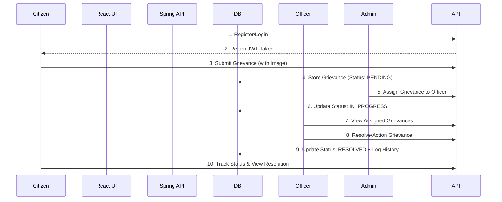

# Smart Grievance Redressal System (SGS)

A professional, production-ready grievance redressal platform designed for efficient communication between citizens, department officers, and administrators. Built with a modern tech stack (Spring Boot 3, REST APIs, React + Vite, and JWT), it ensures security, scalability, and transparency.

---

## 🏗️ System Architecture

The project follows a **Decoupled Architecture** with a clear separation between the backend API and frontend user interface:

-   **Backend**: Spring Boot 3 with RESTful APIs, Spring Data JPA for persistence, and Spring Security with JWT for stateless authentication. Documented fully in [Backend Architecture](backend.md).
-   **Frontend**: Standalone React application powered by Vite, utilizing modern React hooks, Redux Toolkit for state management, React Router for navigation, and customized via the premium "Dimensional Interface" aesthetic from the Stitch design system. Documented fully in [Frontend Architecture](Frontend/frontend.md).
-   **Security**: Role-Based Access Control (RBAC) with three distinct roles: `USER` (Citizen), `OFFICER`, and `ADMIN`.

### 🔄 Project Flow & Logic




---

## 🚀 Key Features

### 👤 Citizen (USER)
- **Instant Registration**: Secure signup with email verification.
- **Dimensional Dashboard**: Premium, centralized portal detailing recent grievances, personalized metrics, and global feeds.
- **Smart Submission**: Submit grievances with titles, categorized departments, priority levels, and file attachments (images).
- **Profile Management**: Manage account details and security credentials natively.
- **Real-time Tracking**: Monitor grievance status from 'Pending' to 'Resolved'.

### 👮 Officer
- **Dedicated Dashboard**: View grievances specifically assigned to your department.
- **Status Updates**: Transition grievances through various stages (In Progress, Resolved, Rejected).
- **Audit Trail**: Add remarks and history logs for each action taken.

### 🔑 Administrator
- **Centralized Control**: Full visibility into all system grievances.
- **Resource Management**: Manage departments, users, and officer assignments.
- **Advanced Analytics**: Real-time stats, department-wise performance, and trend charts.

---

## 🎨 UI/UX & Design

- **Stitch Design System**: Beautiful and premium "Dimensional Interface" utilizing responsive React components.
- **Aesthetic**: Deep Aether Purple and Prism Cyan color scheme with crisp glassmorphism, dynamic layouts, and modern typography.
- **Global Feed**: Chronological display of recent anonymous and public grievances across the entire platform.

---

## 🔒 Security Implementation

-   **JWT Stateless Auth**: Tokens are securely issued upon login and stored in the client state.
-   **Interceptor Pattern**: Custom Axios interceptors automatically attach authentication headers to verify all backend requests.
-   **RBAC**: Secured Spring endpoints using `@PreAuthorize` depending on authenticated user roles.
-   **Password Protection**: BCrypt hashing for all user credentials in the database.

---

## 📡 API Reference

### 🔐 Authentication (`/api/auth`)
| Endpoint | Method | Description |
| :--- | :--- | :--- |
| `/register` | `POST` | Create a new user account |
| `/login` | `POST` | Authenticate and get JWT token |
| `/logout` | `POST` | Invalidate session (client-side) |

### 📝 Grievances (`/api/grievances`)
| Endpoint | Method | Description |
| :--- | :--- | :--- |
| `/` | `POST` | Submit a new grievance (Multipart) |
| `/my` | `GET` | List grievances for the logged-in user |
| `/recent` | `GET` | Get top 3 latest pending grievances |
| `/{id}` | `GET` | Get detailed grievance information |
| `/assigned` | `GET` | List grievances assigned to the officer |
| `/{id}/status`| `PUT` | Update status and add remarks |
| `/{id}` | `DELETE`| Remove a grievance (Admin Only) |

### 📊 Dashboards (`/api/dashboard`)
| Endpoint | Method | Description |
| :--- | :--- | :--- |
| `/user` | `GET` | Statistics for citizen dashboard |
| `/officer` | `GET` | Metrics for officer performance |
| `/admin` | `GET` | System-wide analytics and trends |

---

## 📁 Project Structure

```text
smart-grievance-system/
├── Frontend/               # React + Vite application
│   ├── src/
│   │   ├── components/     # Reusable UI elements (Layouts, Forms, Shadcn components)
│   │   ├── lib/            # Axios API configurations
│   │   ├── pages/          # Application views (Dashboard, Grievances, Profile, Auth)
│   │   └── store/          # Redux Toolkit state slices
│   └── frontend.md         # Detailed Frontend Architecture Document 
├── src/main/java/com/grievance/ # Spring Boot Backend Architecture
│   ├── controller/         # REST API endpoints
│   ├── entity/             # JPA Entities (MySQL Database Mappings)
│   ├── repository/         # Data Access Layer
│   ├── security/           # JWT & Spring Security Configurations
│   └── service/            # Core Business Logic Implementations
├── backend.md              # Detailed Backend Architecture Document
└── pom.xml                 # Maven Configurations and Dependencies
```

---

## 🛠️ Setup & Installation

### Prerequisites
- Node.js 18+ (for Frontend Vite Server)
- Java 17+ (for Spring Boot Backend)
- MySQL 8.0
- Maven 3.6+

### Steps

1. **Database Setup**:
   ```sql
   CREATE DATABASE smart_grievance_db;
   ```
2. **Backend Config**: Open up `src/main/resources/application.properties` and add your MySQL username/password credentials.
3. **Start Backend**:
   ```bash
   mvn clean install
   mvn spring-boot:run
   ```
4. **Start Frontend** (in a new terminal):
   ```bash
   cd Frontend
   npm install
   npm run dev
   ```
5. **Access Application**: Navigate to `http://localhost:5173` on your browser.

---

## 📈 Database Schema
- **Users**: Central identity table with role distribution.
- **Departments**: Mapping for various government/organization sectors.
- **Grievances**: Core table storing titles, descriptions, and file paths.
- **Grievance History**: Audit log for every status change.
- **Feedback**: Post-resolution ratings from citizens.

---
*Developed with ❤️ by the SGS Team.*
