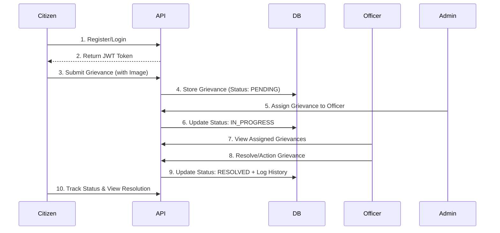

# Smart Grievance Redressal System (SGS)

A professional, production-ready grievance redressal platform designed for efficient communication between citizens, department officers, and administrators. Built with a modern tech stack (Spring Boot 3, MySQL 8, and JWT), it ensures security, scalability, and transparency.

---

## 🏗️ System Architecture

The project follows a **Modified Layered Architecture** with a clear separation of concerns:

-   **Backend**: Spring Boot 3 with RESTful APIs, Spring Data JPA for persistence, and Spring Security with JWT for stateless authentication.
-   **Frontend**: Server-side rendering using **Thymeleaf**, styled with **Bootstrap 5**, and enhanced with AJAX (Fetch API) for dynamic updates and JWT handling.
-   **Security**: Role-Based Access Control (RBAC) with three distinct roles: `USER` (Citizen), `OFFICER`, and `ADMIN`.

### 🔄 Project Flow & Logic



---

## 🚀 Key Features

### 👤 Citizen (USER)
- **Instant Registration**: Secure signup with email verification.
- **Smart Submission**: Submit grievances with titles, categorized departments, priority levels, and file attachments (images).
- **Real-time Tracking**: Monitor grievance status from 'Pending' to 'Resolved'.
- **Grievance History**: Comprehensive dashboard showing all past submissions.
- **Closure**: Option to close grievances if addressed satisfactorily.

### 👮 Officer
- **Dedicated Dashboard**: View grievances specifically assigned to your department.
- **Status Updates**: Transition grievances through various stages (In Progress, Resolved, Rejected).
- **Audit Trail**: Add remarks and history logs for each action taken.
- **Productivity Tracking**: Monitor own resolution metrics.

### 🔑 Administrator
- **Centralized Control**: Full visibility into all system grievances.
- **Resource Management**: Manage departments, users, and officer assignments.
- **Advanced Analytics**: Real-time stats, department-wise performance, and trend charts.
- **Grievance Lifecycle Management**: Manually assign or delete grievances.

---

## 🔒 Security Implementation

-   **JWT Stateless Auth**: Tokens are issued upon login and stored in the client's `localStorage`.
-   **Interceptor Pattern**: A custom `JwtAuthenticationFilter` intercepts every `/api/**` request to validate the token.
-   **RBAC**: Secured endpoints using `@PreAuthorize` based on roles.
-   **Password Protection**: BCrypt hashing for all user credentials.
-   **Safe File Storage**: Isolated storage for attachments with unique UUID naming.

---

## 📡 API Reference

### 🔐 Authentication (`/api/auth`)
| Endpoint | Method | Description |
| :--- | :--- | :--- |
| `/register` | `POST` | Create a new user account |
| `/login` | `POST` | Authenticate and get JWT token |
| `/logout` | `POST` | Invalidate session (client-side) |

### 📝 Grievances (`/api/grievances`)
| Endpoint | Method | Description |
| :--- | :--- | :--- |
| `/` | `POST` | Submit a new grievance (Multipart) |
| `/my` | `GET` | List grievances for the logged-in user |
| `/recent` | `GET` | Get top 3 latest pending grievances |
| `/{id}` | `GET` | Get detailed grievance information |
| `/assigned` | `GET` | List grievances assigned to the officer |
| `/{id}/status`| `PUT` | Update status and add remarks |
| `/{id}` | `DELETE`| Remove a grievance (Admin Only) |

### 📊 Dashboards (`/api/dashboard`)
| Endpoint | Method | Description |
| :--- | :--- | :--- |
| `/user` | `GET` | Statistics for citizen dashboard |
| `/officer` | `GET` | Metrics for officer performance |
| `/admin` | `GET` | System-wide analytics and trends |

---

## 📁 Project Structure

```text
smart-grievance-system/
├── src/main/java/com/grievance/
│   ├── config/             # Security & Bean configurations
│   ├── controller/         # REST API & View Controllers
│   ├── dto/                # Data Transfer Objects
│   ├── entity/             # JPA Entities (MySQL Mappings)
│   ├── enums/              # Priority & Status Enums
│   ├── exception/          # Global Exception Handling
│   ├── repository/         # Data Access Layer (Spring Data JPA)
│   ├── security/           # JWT & Spring Security Logic
│   ├── service/            # Core Business Logic Implementation
│   └── util/               # Helper Utilities
├── src/main/resources/
│   ├── static/             # CSS, JS, and uploaded images
│   ├── templates/          # Thymeleaf HTML Fragments & Pages
│   └── application.properties # System Configuration
└── pom.xml                 # Maven Dependencies
```

---

## 🛠️ Setup & Installation

### Prerequisites
- Java 17+
- MySQL 8.0
- Maven 3.6+

### Steps
1. **Clone & Database**:
   ```sql
   CREATE DATABASE smart_grievance_db;
   ```
2. **Properties**: Configure `src/main/resources/application.properties` with your MySQL credentials.
3. **Build**:
   ```bash
   mvn clean install
   ```
4. **Run**:
   ```bash
   mvn spring-boot:run
   ```

---

## 📈 Database Schema
- **Users**: Central identity table with role distribution.
- **Departments**: Mapping for various government/organization sectors.
- **Grievances**: Core table storing titles, descriptions, and file paths.
- **Grievance History**: Audit log for every status change.
- **Feedback**: Post-resolution ratings from citizens.

---
*Developed with ❤️ by the SGS Team.*
