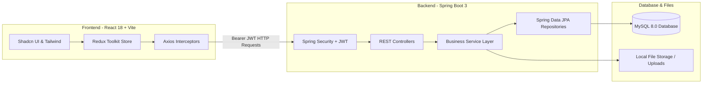

# Smart Grievance Redressal System (SGS)

A modern, production-grade **Smart Grievance Redressal System** designed for high-efficiency complaint resolution, institutional accountability, and transparent collaboration between **Citizens**, **Department Grievance Officers**, and **System Administrators**.

Built using **Spring Boot 3 (Java 17, Spring Security JWT, Spring Data JPA)** and **React 18 (Vite, Tailwind CSS, Shadcn UI, Redux Toolkit)**.

---

## 🏗️ System Architecture

The application adopts a clean, decoupled client-server architecture:


```mermaid
flowchart LR
    subgraph Client [Frontend - React 18 + Vite]
        UI[Shadcn UI & Tailwind]
        RTK[Redux Toolkit Store]
        AX[Axios Interceptors]
    end

    subgraph Server [Backend - Spring Boot 3]
        SEC[Spring Security + JWT]
        CTRL[REST Controllers]
        SVC[Business Service Layer]
        DATA[Spring Data JPA Repositories]
    end

    subgraph Storage [Database & Files]
        DB[(MySQL 8.0 Database)]
        FS[Local File Storage / Uploads]
    end

    UI --> RTK --> AX
    AX -->|Bearer JWT HTTP Requests| SEC --> CTRL --> SVC --> DATA
    DATA --> DB
    SVC --> FS
```

* **Backend**: Spring Boot 3 REST API with stateless JWT authentication and role-based access control.
* **Frontend**: Fast Vite-powered React 18 SPA utilizing Shadcn UI components, responsive Tailwind CSS layouts, and Redux Toolkit state slices.
* **Database**: MySQL 8.0 schema with relational integrity and automated indexing.

---

## 👥 Roles & Core Portals

### 1. 👤 Citizen Portal (`ROLE_USER`)
* **Self-Service Registration & Login**: Instant onboarding with validation and JWT token issuance.
* **Grievance Submission**: Submit complaints categorized by department and priority (`LOW`, `MEDIUM`, `HIGH`) with optional image/document evidence attachments.
* **Live Status Tracking**: Monitor progression through `PENDING` ➔ `IN_PROGRESS` ➔ `RESOLVED` / `REJECTED`.
* **Public Feed & Upvoting**: View anonymous campus/public grievances and upvote issues to boost administrative attention.
* **Resolution Feedback**: Provide star ratings (1–5) and remarks upon resolution.

### 2. 👮 Officer Portal / Department Dashboard (`ROLE_OFFICER`)
* **Department-Bound Scoping**: Officers strictly access and process tickets under their assigned department.
* **Top KPI Stat Cards**:
  * **Department Pool**: Unassigned grievances waiting for pickup.
  * **My Active Tasks**: In-progress grievances assigned to the logged-in officer.
  * **Resolved by Me**: Historical completed cases.
  * **SLA Warnings**: Live count of overdue / breached tickets.
* **3-Tab Queue Interface**:
  * **Department Queue**: Browse unassigned department pool with one-click **"Accept & Start"** action.
  * **My Active Workload**: View assigned active tickets with **"Resolve / Reject"** action.
  * **Resolved History**: Read-only historical timeline with timestamps and recorded remarks.
* **Resolution Slide-over Drawer (Shadcn `Sheet`)**:
  * View ticket summary, description, and attached evidence preview.
  * Select official outcome (`RESOLVED` / `REJECTED`).
  * Compulsory **Resolution Remarks** field with live validation.
  * Automatic audit trail archiving in `grievance_history`.

### 3. 🔑 Administrator Panel (`ROLE_ADMIN`)
* **System-Wide Analytics**: Real-time KPI counters, department performance breakdown, and trend metrics.
* **Department Management**: Create, edit, and manage public/campus departments.
* **User & Officer Management**: Manage user roles, assign officers to departments, and toggle active status.
* **Direct Grievance Assignment**: Assign unassigned tickets directly to specific officers.

---

## 🔑 Default Seeded Accounts & Credentials

The system automatically initializes essential default accounts and departments on startup via `DataInitializer.java`:

| Role | Username | Password | Assigned Department | Purpose |
| :--- | :--- | :--- | :--- | :--- |
| **Admin** | `admin12` | `admin1234` | System Administrator | System management & global analytics |
| **Officer** | `officer1` | `officer1234` | Public Works | Officer portal & department redressal |
| **Citizen** | *(Self-register)* | *(Your password)* | N/A | Submit and track personal grievances |

---

## 📡 API Reference

### 🔐 Authentication (`/api/auth`)
| Method | Endpoint | Access | Description |
| :--- | :--- | :--- | :--- |
| `POST` | `/api/auth/register` | Public | Register a new citizen account |
| `POST` | `/api/auth/login` | Public | Authenticate credentials and receive JWT token |
| `POST` | `/api/auth/logout` | Authenticated | Client-side session invalidation |

### 📝 Grievances (`/api/grievances`)
| Method | Endpoint | Access | Description |
| :--- | :--- | :--- | :--- |
| `POST` | `/api/grievances` | Citizen | Submit a new grievance with multipart attachment |
| `GET` | `/api/grievances/my` | Citizen | List grievances submitted by current user |
| `GET` | `/api/grievances/assigned` | Officer, Admin | Fetch department grievances (supports `scope=DEPT_POOL`, `MY_TASKS`, `RESOLVED`) |
| `PUT` | `/api/grievances/{id}/accept` | Officer, Admin | Accept and start progress on an unassigned department ticket |
| `PUT` | `/api/grievances/{id}/status` | Officer, Admin | Update status to `RESOLVED`/`REJECTED` with mandatory `resolutionRemarks` |
| `GET` | `/api/grievances/{id}` | Authenticated | Fetch full grievance details (with privacy masking) |
| `GET` | `/api/grievances/{id}/history`| Authenticated | Retrieve audit trail timeline |
| `POST` | `/api/grievances/{id}/upvote` | Authenticated | Toggle upvote on a grievance |
| `PUT` | `/api/grievances/{id}/close` | Citizen | Close grievance submitted by current user |
| `DELETE`| `/api/grievances/{id}` | Admin | Delete a grievance record |

### 📊 Dashboard & Metrics (`/api/dashboard`)
| Method | Endpoint | Access | Description |
| :--- | :--- | :--- | :--- |
| `GET` | `/api/dashboard/officer` | Officer, Admin | Officer KPIs (`deptUnassignedCount`, `myActiveTasksCount`, `myResolvedCount`, `slaBreachedCount`) |
| `GET` | `/api/dashboard/user` | Citizen | Citizen metrics and personal rating stats |
| `GET` | `/api/dashboard/admin` | Admin | System-wide statistics and department analytics |

### 💬 Feedback (`/api/feedback`)
| Method | Endpoint | Access | Description |
| :--- | :--- | :--- | :--- |
| `POST` | `/api/feedback` | Citizen | Submit rating (1–5) and review for a resolved grievance |
| `GET` | `/api/feedback/grievance/{id}`| Authenticated | Get feedback reviews for a specific grievance |

---

## 📧 Email Notification Service

The application includes an asynchronous email notification engine (`EmailService.java`):

* **Development Mode (Automatic Mocking)**:
  When default placeholder credentials (`your-email@gmail.com` / `your-app-password`) are present in `application.properties`, email dispatch is automatically simulated in the console logs (`📧 [Dev Email Mock] ...`) without throwing authentication errors or blocking requests.
* **Production / Live Gmail SMTP Setup**:
  To enable live email delivery:
  1. Go to **Google Account** ➔ **Security** ➔ **2-Step Verification** ➔ **App Passwords**.
  2. Generate a 16-character App Password.
  3. Set the credentials in `Backend/src/main/resources/application.properties`:
     ```properties
     spring.mail.username=your-real-email@gmail.com
     spring.mail.password=your-16-char-app-password
     ```

---

## 🛠️ Setup & Running Locally

### Prerequisites
* **Java 17+** (JDK)
* **Node.js 18+** & **npm**
* **MySQL 8.0+**
* **Maven 3.8+**

### 1. Database Setup
Create the MySQL database:
```sql
CREATE DATABASE smart_grievance_db;
```
Configure your MySQL database password in `Backend/src/main/resources/application.properties`:
```properties
spring.datasource.url=jdbc:mysql://localhost:3306/smart_grievance_db?useSSL=false&serverTimezone=UTC&allowPublicKeyRetrieval=true
spring.datasource.username=root
spring.datasource.password=YOUR_MYSQL_PASSWORD
```

### 2. Run the Backend
```bash
cd Backend
mvn clean compile
mvn spring-boot:run
```
* Backend starts at `http://localhost:8081`
* Swagger UI Docs: `http://localhost:8081/swagger-ui.html`

### 3. Run the Frontend
In a separate terminal:
```bash
cd Frontend
npm install
npm run dev
```
* Frontend starts at `http://localhost:5173`

---

## 📁 Project Structure

```text
Smart-Grievance-System/
├── Backend/
│   ├── src/main/java/com/grievance/
│   │   ├── config/          # Security, DataInitializer & App Configurations
│   │   ├── controller/      # REST API Controllers (Auth, Grievance, Officer, Dashboard)
│   │   ├── dto/             # Request & Response Data Transfer Objects
│   │   ├── entity/          # JPA Entities (User, Grievance, Department, History, Feedback)
│   │   ├── enums/           # GrievanceStatus, Priority, Role
│   │   ├── repository/      # Spring Data JPA Repositories
│   │   ├── security/        # JWT Token Provider & Filter
│   │   └── service/         # Business Logic & Email Service
│   ├── src/main/resources/
│   │   ├── application.properties # Server, DB, JWT & Mail Config
│   │   └── db/schema.sql    # Relational Database Schema
│   └── pom.xml              # Maven Dependencies & Build Configuration
│
└── Frontend/
    ├── src/
    │   ├── components/      # UI components (Navbar, Footer, Modals, Shadcn UI)
    │   ├── lib/             # Axios API Client & Utility Functions
    │   ├── pages/           # Pages (DashboardPage, OfficerDashboardPage, Login, Register)
    │   ├── store/           # Redux Toolkit Auth & App State
    │   ├── App.jsx          # Route Definitions & Role Guarding
    │   └── main.jsx         # React DOM Entrypoint
    ├── tailwind.config.js   # Tailwind Theme & Styling Config
    └── package.json         # Frontend Dependencies & Scripts
```

---

## 🛡️ License
Licensed under the MIT License.
