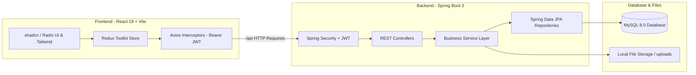

# Smart Grievance Redressal System (SGS)

A modern, production-grade **college campus grievance redressal system** built for transparent, accountable complaint resolution between **Students**, **Department Grievance Officers**, and the **System Administrator**.

Students raise campus issues against a department (Hostel & Accommodation, Academics & Examinations, IT & Infrastructure, Canteen & Mess, Administration), track them through an enforced status lifecycle, and rate the outcome — while officers and admins triage, assign, and resolve tickets through role-scoped dashboards with full audit history.

Built with **Spring Boot 3 (Java 17, Spring Security + JWT, Spring Data JPA)** on the backend and **React 19 (Vite, Tailwind CSS, shadcn/Radix UI, Redux Toolkit)** on the frontend.

---

## 📍 Current Status & Highlights

> Scope note: this README tracks the **current** state of the project. The system has evolved from a civic/municipal grievance demo into a **college-campus (student) grievance portal** with college departments and dedicated demo officers per department.

* ✅ **Auth & profiles** — JWT registration/login/logout, profile editing, password change, role-based access control enforced on every API via `@PreAuthorize`.
* ✅ **Three role portals** — role-aware dashboards for students, department officers, and the admin (React Router v7 + Redux Toolkit).
* ✅ **Full grievance lifecycle** — `PENDING ➔ ASSIGNED ➔ IN_PROGRESS ➔ RESOLVED/REJECTED` plus `CLOSED_BY_USER`, with **server-side transition validation** (`ALLOWED_TRANSITIONS`) and an audit trail in `grievance_history`.
* ✅ **Officer workflow** — department-scoped 3-tab queue (Department Pool / My Active Workload / Resolved History), "Accept & Start", and a resolution drawer with **mandatory remarks** for resolve/reject.
* ✅ **Admin console** — analytics + charts, department CRUD, user/officer management, direct grievance-to-officer assignment, priority override, bulk select, and SLA/escalation warnings.
* ✅ **Student engagement** — public/recent grievance feed, upvoting, per-grievance star ratings (1–5) + reviews.
* ✅ **Evidence attachments** — optional file upload with validation (see [Security & Data Validation](#-security--data-validation)).
* ✅ **Email notifications** — async email engine with automatic **dev mock mode** when SMTP placeholders are detected (see [Email Notification Service](#-email-notification-service)).
* ✅ **College seed data (dev profile)** — 5 campus departments + admin + 5 demo officers, seeded only when the `dev` Spring profile is active.
* ✅ **Security hardening** — env-var-driven secrets/DB credentials, 5MB upload cap with extension/content-type allowlists, DTO validation, gitignored local config template.

---

## 🏗️ System Architecture

The application adopts a clean, decoupled client-server architecture. The frontend dev server proxies `/api` and `/uploads` to the Spring Boot backend.


```mermaid
flowchart LR
    subgraph Client [Frontend - React 19 + Vite]
        UI[shadcn / Radix UI & Tailwind]
        RTK[Redux Toolkit Store]
        AX[Axios Interceptors - Bearer JWT]
    end

    subgraph Server [Backend - Spring Boot 3]
        SEC[Spring Security + JWT]
        CTRL[REST Controllers]
        SVC[Business Service Layer]
        DATA[Spring Data JPA Repositories]
    end

    subgraph Storage [Database & Files]
        DB[(MySQL 8.0 Database)]
        FS[Local File Storage / uploads]
    end

    UI --> RTK --> AX
    AX -->|/api HTTP Requests| SEC --> CTRL --> SVC --> DATA
    DATA --> DB
    SVC --> FS
```

* **Backend**: Spring Boot 3 REST API with stateless JWT authentication, role-based access control, and validated status transitions.
* **Frontend**: Vite-powered React 19 SPA using shadcn/Radix UI components, responsive Tailwind layouts, Redux Toolkit state slices, Recharts analytics, and React Router v7.
* **Database**: MySQL 8.0 (schema auto-managed by Hibernate `ddl-auto=update`; `schema.sql` kept as a reference).
* **Storage**: Locally stored evidence attachments under `Backend/uploads/`, referenced by unique UUID filenames.

---

## 🔄 Grievance Lifecycle & Validation Rules

Statuses are managed centrally in `GrievanceService.ALLOWED_TRANSITIONS`; any illegal transition is rejected with HTTP `400 Bad Request`:

```text
PENDING ──► ASSIGNED ──► IN_PROGRESS ──► RESOLVED
   │            │             │
   └─────► REJECTED ◄─────────┘     (CLOSED_BY_USER via user close)
```

* **PENDING** — submitted by student, waiting in the department pool (unassigned).
* **ASSIGNED** — admin or officer has assigned an officer; awaiting "Accept & Start".
* **IN_PROGRESS** — officer accepted and is working the ticket.
* **RESOLVED / REJECTED** — terminal officer outcomes; **resolution remarks are compulsory**.
* **CLOSED_BY_USER** — student closes their own resolved/old grievance (terminal).
* Every status change appends a `grievance_history` audit row (who, from, to, remarks, timestamp).
* SLA windows are priority-based (`HIGH` = 7 days, `MEDIUM` = 15 days, `LOW` = 30 days); tickets still active past their window count as **SLA breaches** on officer/admin dashboards.

---

## 👥 Roles & Core Portals

### 1. 🎓 Student Portal (`ROLE_USER`)
* **Self-Service Registration & Login**: instant onboarding with field validation and automatic JWT issuance.
* **Grievance Submission**: pick a campus department, set priority (`LOW` / `MEDIUM` / `HIGH`), describe the issue, and optionally attach evidence.
* **Live Status Tracking**: follow the ticket through the lifecycle above with a full history/audit timeline.
* **Recent Grievances Feed & Upvoting**: view recent campus issues and upvote them to raise attention.
* **Close & Feedback**: close a grievance from your side, and after resolution provide a 1–5 star rating with remarks.

### 2. 👮 Officer Portal (`ROLE_OFFICER`)
* **Department-Bound Scoping**: officers see and process tickets **only for their assigned department**.
* **Top KPI Stat Cards**:
  * **Department Pool** — unassigned grievances waiting for pickup.
  * **My Active Tasks** — in-progress grievances assigned to the logged-in officer.
  * **Resolved by Me** — historical completed cases.
  * **SLA Breaches** — live count of active tickets past their priority SLA window.
* **3-Tab Queue Interface**:
  * **Department Queue** (`scope=DEPT_POOL`): browse the unassigned pool and pick up tickets with **"Accept & Start"**.
  * **My Active Workload** (`scope=MY_TASKS`): view assigned active tickets and act with **Resolve / Reject**.
  * **Resolved History** (`scope=RESOLVED`): read-only resolved timeline with timestamps and remarks.
* **Resolution Drawer (Shadcn `Sheet`)**:
  * Ticket summary, description, evidence preview, and assigned student context.
  * Outcome selector (`RESOLVED` / `REJECTED`) with **compulsory resolution remarks** (live validation).
  * Automatic audit-trail archiving in `grievance_history` + email notification to the student.

### 3. 🔑 Administrator Panel (`ROLE_ADMIN`)
* **System-Wide Analytics**: KPI counters (total/resolved/pending/in-progress/rejected/archived), department workload breakdown, and 7-day resolution trend charts (Recharts).
* **SLA & Escalation Monitoring**: alert banner for unresolved tickets older than 48h and active-ticket SLA breach tracking.
* **Department Management**: create, edit, activate, and delete campus departments.
* **User & Officer Management**: list/search users, change roles, assign officers to departments, toggle active status.
* **Grievance Management**: view the full feed with bulk selection, **direct assignment** of pending tickets to any officer, priority override, quick-view drawer, and delete.

---

## 🏫 Campus Departments & Default Seeded Accounts

On startup (only when the **`dev`** Spring profile is active), `DataInitializer.java` creates the five college departments below and guarantees the following demo accounts exist. Seed passwords are overridable via `demo.admin.password` and `demo.officer.password` (properties or env vars). Existing accounts are **not** password-reset on restart.

| Role | Username | Password | Department | Purpose |
| :--- | :--- | :--- | :--- | :--- |
| **Admin** | `admin12` | `admin1234` | System-wide | System management & global analytics |
| **Officer** | `officer1` | `officer1234` | Hostel & Accommodation | Hostel room/maintenance complaints |
| **Officer** | `officer2` | `officer1234` | Academics & Examinations | Academic/exam-related complaints |
| **Officer** | `officer3` | `officer1234` | IT & Infrastructure | WiFi, lab, classroom AV, infrastructure |
| **Officer** | `officer4` | `officer1234` | Canteen & Mess | Food quality, hygiene, mess service |
| **Officer** | `officer5` | `officer1234` | Administration | ID cards, certificates, fee receipts |
| **Student** | *(self-register)* | *(your password)* | N/A | Submit and track personal grievances |

> ⚙️ **Dev profile required for seeding.** Start the backend with the `dev` profile (see [Run the Backend](#2-run-the-backend)) — otherwise no demo data is created and you register fresh accounts normally.

---

## 🔒 Security & Data Validation

* **JWT auth** with stateless, role-based endpoints (`ROLE_USER` / `ROLE_OFFICER` / `ROLE_ADMIN` via `@PreAuthorize`); frontend attaches `Bearer` tokens via an Axios interceptor and logs out on 401/403.
* **Env-var-driven secrets & DB credentials** — no hardcoded production passwords (see [Configuration Reference](#-configuration-reference)).
* **File upload validation** (`FileStorageService`): max **5 MB**; extension + content-type allowlist (**JPEG / PNG / PDF**); stored under unique UUID names in `uploads/`; violations raise `400 Bad Request`.
* **DTO validation** wired on registration, login, grievance submission, status updates, profile, and feedback requests.
* **Seed data gated to the `dev` profile** so demo accounts never leak into production; legacy `admin` account is removed/deactivated.
* **Privacy masking** — students can only view full details of their own grievances; the public/recent feed strips sensitive fields for regular users.

---

## 📧 Email Notification Service

An asynchronous (`@Async`, `@EnableAsync`) email engine in `EmailService.java` dispatches:

* **Welcome email** on registration
* **Submission confirmation** with the grievance tracking number
* **Assignment notification** to the responsible officer
* **Status update notifications** to the student
* **Resolution notification** inviting post-resolution feedback

* **Development Mode (Automatic Mocking)**: while placeholder SMTP credentials (`your-email@gmail.com` / `your-app-password`) are configured, dispatch is simulated in the console (`📧 [Dev Email Mock] ...`) instead of failing or blocking requests.
* **Production / Live Gmail SMTP**: generate a 16-character [Google App Password](https://support.google.com/accounts/answer/185833) and set real values:
  ```properties
  spring.mail.username=your-real-email@gmail.com
  spring.mail.password=your-16-char-app-password
  ```
  (Both can also be supplied as `MAIL_USERNAME` / `MAIL_PASSWORD` env vars.)

---

## 📡 API Reference

Base URL: `http://localhost:8081` — interactive docs at [`/swagger-ui.html`](http://localhost:8081/swagger-ui.html) (OpenAPI spec at `/api-docs`). All endpoints except `register`/`login` require `Authorization: Bearer <JWT>`.

### 🔐 Authentication — `/api/auth`
| Method | Endpoint | Access | Description |
| :--- | :--- | :--- | :--- |
| `POST` | `/api/auth/register` | Public | Register a student account (auto-login + JWT) |
| `POST` | `/api/auth/login` | Public | Authenticate and receive a JWT token |
| `POST` | `/api/auth/logout` | Authenticated | Client-side session invalidation |

### 📝 Grievances & Departments — `/api/grievances`
| Method | Endpoint | Access | Description |
| :--- | :--- | :--- | :--- |
| `GET` | `/api/grievances/departments` | USER | List active campus departments for submission |
| `POST` | `/api/grievances` | USER | Submit grievance (`multipart`: `data` + optional `file`) |
| `GET` | `/api/grievances/my` | USER | List grievances submitted by the current user |
| `GET` | `/api/grievances/recent` | Authenticated | Recent grievance feed |
| `GET` | `/api/grievances/all` | Authenticated | Global feed (privacy-masked for regular users) |
| `GET` | `/api/grievances` | OFFICER, ADMIN | Full grievance list |
| `GET` | `/api/grievances/{id}` | Authenticated | Full details with role-based privacy masking |
| `GET` | `/api/grievances/{id}/history` | Authenticated | Audit-trail timeline |
| `GET` | `/api/grievances/officers` | OFFICER, ADMIN | List officers for assignment |
| `PUT` | `/api/grievances/{id}/accept` | OFFICER, ADMIN | Accept a department-pool ticket (➔ `IN_PROGRESS`) |
| `PUT` | `/api/grievances/{id}/status` | OFFICER, ADMIN | Update status (`RESOLVED`/`REJECTED` + remarks required) |
| `PUT` | `/api/grievances/{id}/priority` | OFFICER, ADMIN | Override ticket priority |
| `PUT` | `/api/grievances/{id}/close` | USER | Close own grievance (`CLOSED_BY_USER`) |
| `POST` | `/api/grievances/{id}/upvote` | Authenticated | Toggle upvote on a grievance |
| `DELETE` | `/api/grievances/{id}` | ADMIN | Delete a grievance record |

**Officer scoped queue** — `GET /api/grievances/assigned?scope=DEPT_POOL|MY_TASKS|RESOLVED` returns the appropriate list for the authenticated officer's department.

### 📊 Dashboard & Metrics — `/api/dashboard`
| Method | Endpoint | Access | Description |
| :--- | :--- | :--- | :--- |
| `GET` | `/api/dashboard/user` | USER | Student metrics (total/pending/in-progress/resolved + rating) |
| `GET` | `/api/dashboard/officer` | OFFICER, ADMIN | Officer KPIs (`deptUnassignedCount`, `myActiveTasksCount`, `myResolvedCount`, `slaBreachedCount`) |
| `GET` | `/api/dashboard/admin` | ADMIN | System-wide statistics & per-department breakdown |
| `GET` | `/api/dashboard/statistics` | Authenticated | Grievance counts grouped by status |

### 💬 Feedback — `/api/feedback`
| Method | Endpoint | Access | Description |
| :--- | :--- | :--- | :--- |
| `POST` | `/api/feedback` | USER | Submit 1–5 star rating + comments for a resolved grievance |
| `GET` | `/api/feedback/grievance/{id}` | Authenticated | Reviews for a specific grievance |
| `GET` | `/api/feedback/grievance/{id}/rating` | Authenticated | Average rating for a grievance |
| `GET` | `/api/feedback/my` | USER | Feedback left by current user |
| `DELETE` | `/api/feedback/{feedbackId}` | USER | Delete own feedback |

### 👤 User Management — `/api/user`
| Method | Endpoint | Access | Description |
| :--- | :--- | :--- | :--- |
| `GET` / `PUT` | `/api/user/profile` | Authenticated | Get / update own profile |
| `PUT` | `/api/user/change-password` | Authenticated | Change own password |
| `GET` | `/api/user?page=&size=` | ADMIN | Paginated user list |
| `PUT` | `/api/user/{id}/activate` · `/deactivate` | ADMIN | Toggle user active status |
| `PUT` | `/api/user/{id}/role` | ADMIN | Change a user's role |
| `PUT` | `/api/user/{id}/department` | ADMIN | Assign officer to a department |
| `DELETE` | `/api/user/{id}` | ADMIN | Delete a user |

### 🏛️ Admin Console — `/api/admin`
| Method | Endpoint | Access | Description |
| :--- | :--- | :--- | :--- |
| `GET` / `POST` | `/api/admin/departments` | ADMIN | List / create departments |
| `GET` / `PUT` / `DELETE` | `/api/admin/departments/{id}` | ADMIN | Read / update / delete a department |
| `POST` | `/api/admin/grievances/{id}/assign/{officerId}` | ADMIN | Assign a pending ticket directly to an officer |
| `GET` | `/api/admin/grievances` | ADMIN | All grievances |
| `GET` | `/api/admin/users` / `users/{id}` | ADMIN | Paginated user list / user details |
| `PUT` | `/api/admin/users/{id}/toggle-active?isActive=` | ADMIN | Toggle a user's active status |
| `DELETE` | `/api/admin/users/{id}` | ADMIN | Delete a user |
| `GET` | `/api/admin/statistics` | ADMIN | Total grievances / departments / users counters |

---

## 🧭 Frontend Routes

| Route | Page | Audience |
| :--- | :--- | :--- |
| `/login` · `/register` | Login / Register | Public |
| `/dashboard` | Citizen dashboard **or** Officer dashboard (role-aware selector) | USER / OFFICER |
| `/officer`, `/officer-dashboard` | Officer dashboard & resolution queue | OFFICER / ADMIN |
| `/admin`, `/recent-grievances` | Recent/global grievances, admin actions & assignment | Authenticated (admin-focused) |
| `/grievances` | My grievances | USER |
| `/grievances/new` | New grievance submission | USER / ADMIN |
| `/grievances/:id` | Grievance details + audit history | Authenticated |
| `/profile` | Profile & password management | Authenticated |
| `/privacy-policy` | Privacy policy | Authenticated |

---

## 🛠️ Setup & Running Locally

### Prerequisites
* **Java 17+** (JDK) & **Maven 3.8+**
* **Node.js 18+** & **npm**
* **MySQL 8.0+** running locally

### 1. Database Setup
Create the database (name is configurable via `DB_NAME`):
```sql
CREATE DATABASE smart_grievance_db;
```

Configure your MySQL credentials **without editing tracked files** — either export env vars:
```bash
export DB_USERNAME=root
export DB_PASSWORD=YOUR_MYSQL_PASSWORD
```
or create the gitignored local override (recommended for per-machine tweaks):
```bash
cp Backend/src/main/resources/application-local.properties.example \
   Backend/src/main/resources/application-local.properties
# then fill in your password in application-local.properties
```
Tables are created/updated automatically by Hibernate (`ddl-auto=update`).

### 2. Run the Backend
```bash
cd Backend
mvn clean compile
mvn spring-boot:run -Dspring-boot.run.profiles=dev   # seeds demo departments & accounts
```
* Backend starts at `http://localhost:8081` (`SERVER_PORT` to override)
* Swagger UI: `http://localhost:8081/swagger-ui.html`
* Actuator health: `http://localhost:8081/actuator/health`

### 3. Run the Frontend
In a separate terminal:
```bash
cd Frontend
npm install
npm run dev
```
* Frontend starts at `http://localhost:5173` and proxies `/api` + `/uploads` to `http://localhost:8081`.
* Production build: `npm run build` → outputs to `Frontend/dist`.

---

## ⚙️ Configuration Reference

All externalized via environment variables in `Backend/src/main/resources/application.properties`:

| Variable | Default | Purpose |
| :--- | :--- | :--- |
| `SERVER_PORT` | `8081` | Backend HTTP port |
| `DB_HOST` / `DB_PORT` / `DB_NAME` | `localhost` / `3306` / `smart_grievance_db` | MySQL connection |
| `DB_USERNAME` / `DB_PASSWORD` | `root` / *(empty)* | MySQL credentials |
| `JWT_SECRET_KEY` | dev-only default | JWT signing secret (**override in prod**) |
| `JWT_EXPIRATION` / `JWT_REFRESH_EXPIRATION` | `86400000` / `604800000` | Access/refresh token TTL (ms) |
| `MAIL_USERNAME` / `MAIL_PASSWORD` | placeholders | SMTP creds (placeholders ⇒ dev mock) |
| `UPLOAD_DIR` | `uploads/` | Evidence attachment storage path |
| `JPA_DDL_AUTO` | `update` | Hibernate schema mode |
| `SWAGGER_ENABLED` | `true` | Toggle Swagger UI |
| `demo.admin.password` / `demo.officer.password` | `admin1234` / `officer1234` | Dev seed passwords |
| `SPRING_PROFILES_ACTIVE` | — | `dev` activates seed data |

---

## 📁 Project Structure

```text
Smart-Grievance-System/
├── Backend/
│   ├── src/main/java/com/grievance/
│   │   ├── config/          # Security, DataInitializer, FileUpload & App Config
│   │   ├── controller/      # REST Controllers (Auth, Grievance, Officer, Admin, User, Feedback, Dashboard)
│   │   ├── dto/             # Request & Response DTOs (validation annotations)
│   │   ├── entity/          # JPA Entities (User, Grievance, Department, GrievanceHistory, Feedback, Upvote)
│   │   ├── enums/           # GrievanceStatus, Priority, Role
│   │   ├── exception/       # GlobalExceptionHandler + typed exceptions
│   │   ├── repository/      # Spring Data JPA Repositories
│   │   ├── security/        # JWT Token Provider, Filter, UserDetails
│   │   └── service/         # Business Logic, Email & File Storage Services
│   ├── src/main/resources/
│   │   ├── application.properties            # Server, DB, JWT & Mail config (env-var driven)
│   │   ├── application-local.properties.example # Gitignored local DB override template
│   │   └── db/schema.sql                     # Reference relational schema
│   ├── uploads/             # Stored evidence attachments (runtime, gitignored)
│   └── pom.xml              # Maven dependencies & build
│
└── Frontend/
    ├── src/
    │   ├── components/      # CoreNarrative, NewGrievanceModal, layout + shadcn/ui primitives
    │   ├── lib/             # Axios API client & utilities
    │   ├── pages/           # Login, Register, Dashboard (citizen), OfficerDashboard,
    │   │                    # RecentGrievances (admin), NewGrievance, MyGrievances,
    │   │                    # GrievanceDetails, Profile, PrivacyPolicy
    │   ├── store/           # Redux Toolkit (auth slice + store)
    │   ├── App.jsx          # createBrowserRouter route definitions & guards
    │   └── main.jsx         # React entrypoint
    ├── vite.config.js       # Dev server + /api & /uploads proxy to :8081
    └── package.json         # Dependencies & scripts
```

---

## 🛡️ License
Licensed under the MIT License.
